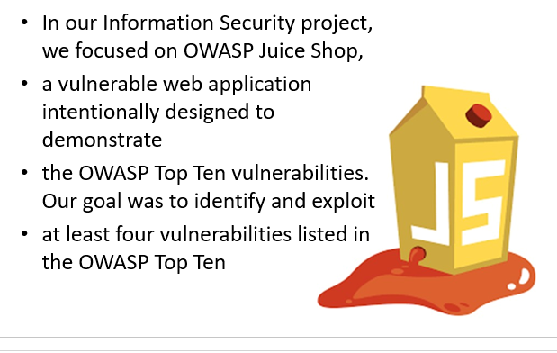

# 🔐 CyberSecurity - OWASP Juice Shop

Cybersecurity lab project demonstrating vulnerability assessment and penetration testing on the OWASP Juice Shop application using Kali Linux and Burp Suite.

## 📸 Project Screenshot

## 🛠️ Tools Used
- Kali Linux
- Burp Suite
- OWASP Juice Shop
- Web Browser Developer Tools

## 🔍 Skills Demonstrated
- Web Application Security Testing
- Penetration Testing
- Vulnerability Assessment
- Ethical Hacking Fundamentals
